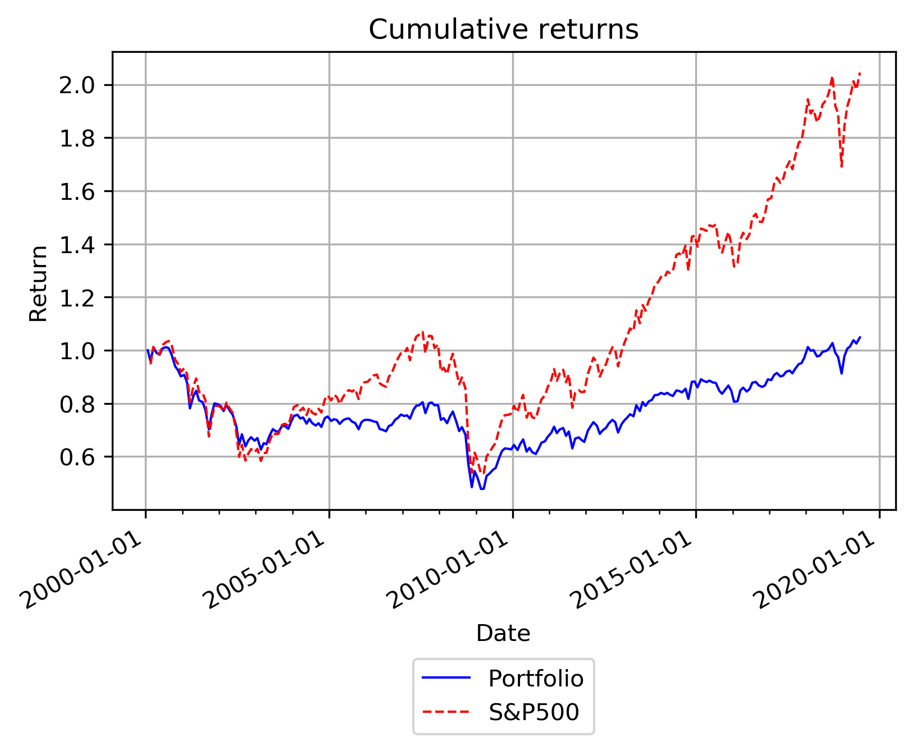

# SP500-options-strategy
 \- as of April 2020 -
 
Quick and dirty program to see what the performance is of a portfolio consisting of a long position in the S&P500 and a long position in (far) OTM S&P500 put options. The rationale is just to see how effective the hedge is with different values of the OTM ratio, different times to maturities for the chosen options and different percentages of the portfolio allocated to the options. 

The portfolio is rebalanced each 3rd Friday of the month, as then new S&P500 options are listed. All options data is obtained from optionmetrics. Unfortunately, the daily options data is available up to June 2020. Performance of the March 2020 crash would have been interesting (although the 2008 crash does not inspire much confidence in the strategy). For speed, the complete (daily) options file is cleaned to the subset of 3rd Friday prices using handleData.py. All important python files can be found in /src and in the notebook all parameters can be adjusted easily. Summary stats are found here as well. 

As an example of the portfolio performance, the following graphs demonstrate the performance of a portfolio where 2.5% of its value is invested in ~90% OTM put options with a minimum maturity of 150 trading days. 

Performance is bad; although the portfolio variance is lower than the S&P500 (0.13 vs 0.17), the annualized Sharpe ratio (over the whole sample period) is 0.08 compared to 0.32 for the S&P500. Even looking at a 3-year moving window Sharpe ratio, the constructed portfolio never outperforms the S&P500. A higher moving window Sharpe ratio in periods of market distress would have been expected, however (even with smaller window sizes) this is not found. 
